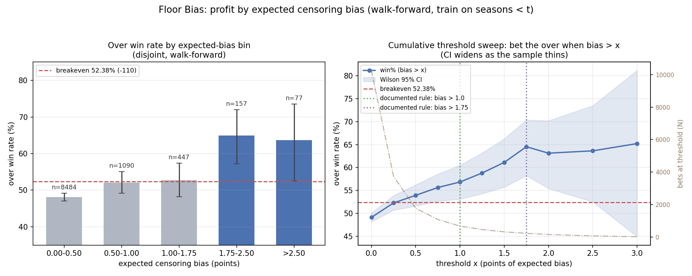

# The Floor Bias model — complete guide

*What this strategy is, why it works, the proof behind it, and exactly how to
use it to place real bets — written to be readable without a statistics
background. Every number comes from 12,493 real college football games,
2013–2025, produced by the code in this repo (figures rebuilt 2026-07-30; bet
threshold revised to 1.75 on 2026-08-11).*

> **What this is:** a research finding that one specific, rare type of bet
> has historically won more often than it should. It is **not** a money
> printer: even if everything here is exactly right, you only get a few dozen
> bets a year, and a losing season happens somewhere between 4% and 35% of
> the time purely by chance. The advantage can also fade as sportsbooks
> catch on. Bet only money you can afford to lose, at legal books, and read
> [§8 Failure modes](#8-failure-modes--limits) before staking anything.

> **The rule changed on 2026-08-11: bet above 1.75, not 1.0.** When we
> separated the historical bets into non-overlapping groups, the winning
> wasn't spread across the old betting range — only the bets above 1.75
> clearly won enough to beat the bookmaker's cut. See
> [§3 The evidence](#3-the-evidence). The old rule wasn't wrong, it was
> watered down: it mixed clearly-good bets with bets we can't prove are good.

## TL;DR

**Bet the OVER on a college football game's total — the combined points
line for both teams — whenever this model's "bias number" for that game is
above 1.75, at a price of −120 or better.**

One command computes the bias number for any game from its spread and total:
`python monitor/score_game.py SPREAD TOTAL`.

How it has done, testing honestly on ten seasons of history (each season bet
using a model that had only seen *earlier* seasons):

| Rule | Bets (2016–2025) | Won | 95% range* | Profit per $1 bet |
|---|---|---|---|---|
| **Bias > 1.75 (the rule)** | 234 (~23/season) | **64.5%** | 58.2%–70.4% | **+23 cents** |
| Bias 1.00–1.75 (*not bet anymore*) | 447 (~45/season) | 52.8% | 48.2%–57.4% | +1 cent |
| Bias > 1.0 (old rule, for reference) | 681 (~70/season) | 56.8% | 53.1%–60.5% | +8.5 cents |

*\*"95% range" = the range the true long-run win rate is 95% likely to fall
in, given this many bets. Small samples → wide ranges.*

To break even at standard betting prices you must win **52.38%** of the time
(explained below). The old rule's 681 bets were really two groups glued
together: 234 bets that clearly beat that bar, plus 447 that sit right on
top of it. Dropping the weak group costs almost nothing — about **+5.4 units
per season vs +5.8** — because each surviving bet wins so much more often.

**Plan on winning ~58%, not 64.5%.** The 64.5% is the best-case reading of a
limited sample (and 1.75 was partly *chosen* because it looked best, which
inflates the number — more in §2 and §3). The bottom of the 95% range is the
honest planning number.

### The vocabulary (read this once)

If you already bet totals, skip ahead. Otherwise, five terms:

- **Spread**: the bookmaker's margin line. "Army −21" means Army is expected
  to win by about 21.
- **Total** (over/under): the bookmaker's line for the two teams' *combined*
  points. You can bet the final combined score goes **over** or **under** it.
  This is the market this strategy bets — over only.
- **Juice / price**: the fee baked into the odds. The standard price is
  **−110**: you risk $110 to win $100. That fee is why winning half your bets
  loses money — at −110 you need **52.38%** winners just to break even. At
  −120 (risk $120 to win $100) you need 54.55%.
- **Unit (u)**: one standard bet size, usually 1% of your bankroll. "+5u"
  means you won five bets' worth.
- **Push**: the final score lands exactly on the line; stakes are returned.

Four point-related quantities appear in this guide; two are markets, two are
model internals. Don't mix them up:

| Term | What it is | Role here |
|---|---|---|
| **Game spread** | The standard point spread (e.g. Army −21) | Model input |
| **Game total** | The over/under on **both teams' combined points** (e.g. 41) | Model input **and the market you bet** (over only) |
| **Implied team points** | Each team's expected score, *calculated* from the two lines above: underdog = (total − spread) / 2 | Internal number — **not** something you can bet |
| **Team total** | A *separate* market on **one** team's points (e.g. "Navy over 13.5") | **Not used and not validated** here (open question 3) |

There is no "team spread" market — *spread* always means the game spread.

---

## 1. Why the over is systematically underpriced

The idea comes from a 2022 academic paper (Arscott, *"Market efficiency and
censoring bias in college football gambling"*, SSRN 4197428), which this
repo re-built from scratch and confirmed on newer data.

Start with what the two lines secretly say about each team. If the favorite
is −21 and the total is 41, a little algebra says the market expects the
underdog to score about **10** and the favorite about **31**:

```
underdog expected points = (total − spread) / 2     # (41 − 21) / 2 = 10
favorite expected points = underdog + spread        # 10 + 21 = 31
```

Here's the catch. A team "expected to score 10" doesn't score exactly 10 —
some days it scores 24, some days it scores 3. The bookmaker's line sits in
the middle of those possibilities. But one side of the middle is **chopped
off: a team cannot score fewer than zero points.** A 10-point underdog that
has a nightmare day doesn't score −8; it scores 0. Bad days are capped at
zero while great days are not capped at all.


That lopsidedness means the *actual average* score of a weak team is a
little **higher** than the line implies — the impossible negative games get
replaced by zeros, which pulls the average up. Statisticians call this
*censoring bias*; we call it the **floor effect**, and it can be computed
exactly (the formula is in the figure above). With the score-to-score
randomness measured in this data (about ±11 points per team), the effect is
worth about **1 point** for a team expected to score 10, and essentially
**zero** for a team expected to score 25+.

Two consequences, both confirmed in the data:

- **Totals**: the two teams' floor effects *add up*. Real combined scores
  systematically beat low totals lines → **the over is underpriced**,
  specifically in games where one team's expected score is close to zero.
- **Spreads**: the two effects roughly *cancel* (favorite's minus
  underdog's) → the spread stays fair. There is no spread version of this
  edge, and the mirror-image idea — an under edge from scores being capped
  on the high side — was tested and **does not exist**
  ([saturation_bias/](../saturation_bias/), a negative result).

The model's "bias number" for a game is simply the two teams' floor effects
added together, in points: *how many points too low is this total likely to
be, just because scores can't go below zero?*

## 2. The pipeline (what the code actually does)

| Step | What | Where |
|---|---|---|
| 1 | Work out each team's implied points from spread + total | `implied_team_points` ([v2/models_v2.py](../v2/models_v2.py)) |
| 2 | Measure how much scores randomly swing (using a method — *Tobit* — that correctly handles all the scores piled up at 0; ordinary averaging would get this wrong) | `tobit_left_censored_v2` |
| 3 | Compute the game's bias number: underdog floor effect + favorite floor effect | `censoring_bias` |
| 4 | Fit a curve translating bias → chance the over wins, from actual results (*probit*) | `probit_win_v2` |
| 5 | Bet rule: over when bias > 1.75 | drivers / `score_game.py` |

Fitted on all 12,493 games (2013–2025): score randomness ≈ **±11.0 points**
for underdogs, **±11.8** for favorites (the paper found 11.28/11.94 on
different years — a close match). The bias→wins relationship is about as
statistically certain as anything gets in this field (technical note:
probit slope +0.176, standard error 0.020 allowing for seasons moving
together, p ≈ 1e−18).

**Where the 1.75 threshold comes from — and what the change cost us.** The
old 1.0 cutoff was the *paper's* number, adopted untouched — which meant it
couldn't have been cherry-picked to fit our data. 1.75 can't claim that: it
is the best-performing cutoff *found by searching our own ten seasons*
([§3](#3-the-evidence)). Numbers found by searching always look a bit better
than they truly are. Two things soften this: 1.75 was already documented as
the "high-conviction" level before the search was run, and the
group-by-group analysis points to the same region independently. Still —
plan on the bottom of the 95% range, not the headline.

One quirk to know: the fitted curve from step 4 starts saying "the over is
worth betting" around bias ≈ 0.75, and `score_game.py` still prints that
curve's probability. The bet rule deliberately ignores it below 1.75,
because the curve overstates its chances in that zone (see "the calibration
gap" in [§3](#3-the-evidence)). **Trust the verdict column, not the
probability column.**

Only the two betting lines go in. No team ratings, no weather, no injuries —
that's the point: this is a mispricing you can compute from the odds board
itself.

## 3. The evidence

**The raw relationship.** Group all games by their bias number and the
over's actual win rate climbs just as the theory predicts, passing the
52.38% break-even line somewhere around bias 0.75–1.0 — but keep reading,
because the next chart is why the bet rule sits well above that crossing:


**Where the winning actually lives.** The chart above uses *cumulative*
groups ("all games above x"), and those overlap: every group below 1.75
*contains* the strong 1.75+ games, which flatters the weaker games. Cutting
the same honestly-tested bets into **separate, non-overlapping** groups
removes that trick ([`monitor/bias_bins.py`](../monitor/bias_bins.py)):

| Bias group | Bets | Won | 95% range | Profit per $1 |
|---|---|---|---|---|
| 0.00–0.50 | 8,484 | 48.1% | 47.0–49.2 | −8.2¢ |
| 0.50–1.00 | 1,090 | 52.1% | 49.1–55.1 | −0.5¢ |
| **1.00–1.75** | **447** | **52.8%** | **48.2–57.4** | **+0.8¢** |
| **1.75–2.50** | **157** | **65.0%** | **57.2–72.0** | **+24.0¢** |
| **>2.50** | **77** | **63.6%** | **52.5–73.5** | **+21.5¢** |



Only the top two groups clearly beat break-even. The 1.00–1.75 group — 447
bets, most of the old rule's volume — won 52.8%, basically sitting on the
break-even line. Two honest points about that group:

- **"Can't be shown to win" is not the same as "loses."** Its 95% range
  reaches up to 57.4%, so a modest edge could be hiding in there.
- **The sample is too small to ever tell.** With 447 bets, you could only
  reliably detect an edge if the true win rate were **59% or better** — the
  old rule's entire 56.8% edge would be *invisible* in a sample this size.
  Settling the question would take ~1,000 bets in that band, roughly 12 more
  seasons. So excluding it is a practical decision — *don't bet where an
  edge can't be demonstrated* — not a claim those games are traps.

**There is no magic cliff at 1.75.** Sliced finer, the win rates read 52.6%
→ 53.5% → 52.2% → 67.6%, which *looks* like a wall right at 1.75. It isn't:
a formal test (technical note: adding a jump-at-1.75 term to the smooth
bias curve, on all 10,255 honestly-tested games, allowing for seasons moving
together) finds the smooth rise is very real but the extra "jump" is
statistically nothing — p = 0.54, and the slices around 1.75 are only 74–215
bets each, pure noise territory. That's actually what the theory predicts: a
smooth climb, no cliff. **Read 1.75 as the altitude where the climb has
clearly crossed break-even with room to spare — not as a point where
anything special happens.** A game at 1.74 and a game at 1.76 are almost the
same game; both sit at the edge of what the evidence covers.

Three robustness numbers worth knowing (all survive the stricter accounting
where bets in the same season are treated as related, not independent): the
64.5% headline's range is 58.1–71.6 under that accounting; the gap between
the 1.75+ group and the 1.00–1.75 group is +11.7 points with a range of
+2.5 to +21.4 — genuinely above zero; and the "found by searching" inflation
mentioned in §2 measures out at about +1.2 points, already covered by
planning on 58%. One number to watch rather than worry about: **2025, the
most recent and biggest test season (51 bets), was also the weakest at
52.9%** — well within normal noise for 51 bets (±7 points), but exactly the
pattern the decay monitor exists to catch. Re-run the monitor after 2026.

**A second analysis agreed — but don't double-count it.** A separate
experiment ([`monitor/recalibrate.py`](../monitor/recalibrate.py)) asked
whether re-tuning the probability curve would size bets better; it too
concluded the 1.00–1.75 games shouldn't be staked, but failed its own
pre-set bar for adoption (nearly all of its apparent gain came from one
season, 2023). It used the *same ten seasons*, so it's a consistency check,
not independent proof.

**The calibration gap.** The fitted probability curve misreads both key
groups, in opposite directions: it says 55.9% where reality was 52.8%
(1.00–1.75), and 61.3% where reality was 65.0% (1.75–2.50). No simple
adjustment can fix errors pointing opposite ways, which is why the fix was
"change which games you bet," not "re-tune the curve." It also means the
printed probabilities slightly under-sell your best bets.

**The honest test design.** Standard backtests accidentally let the model
peek at the future (they shuffle all seasons together). Everything called
"honestly tested" here uses the strict version: to bet season X, the model
is trained *only on seasons before X* — the way you'd actually have to do
it. Nine of ten test seasons made money:


**Every hard question asked so far, and the answer.** (These were all run
against the old bias > 1.0 rule — they establish the underlying signal is
real, which the threshold change doesn't disturb. None has been re-run at
1.75, where the smaller sample would widen every range.)

| Question | Answer |
|---|---|
| Does it match the original paper? | Yes — paper: 55.7% on 1992–2017 data; this repo: 56.6% on *completely different* years (2013–2025) |
| Does it survive the honest (no-peeking) test? | Yes — 56.83% over 681 bets, 95% range 53.1–60.5, p = 0.02 against break-even |
| Does it survive stricter statistics? | Yes — the core relationship stays overwhelming (p ≈ 1e−18) even treating each season as one blob |
| Is it just soft small-time bookmakers? | No — using only *consensus* (market-wide) lines it got **stronger**: 58.2% on 282 bets |
| Is "bias" just a fancy name for "low total, big favorite"? | No — [v3](../v3/) tested exactly that; the bias number beats the raw total and spread head-to-head, in and out of sample |
| Does a technical shortcut (assuming the two teams' score swings are unrelated) matter? | No — [v2](../v2/) proved the bias number doesn't change either way (measured relatedness: +0.07, tiny) |
| Is the edge already fading? | Not yet — no downward trend through 2025 ([monitor/](../monitor/)), but see §8 |
| Does the mirror-image under bet work? | No — tested and refuted ([saturation_bias/](../saturation_bias/)) |

**How strong is which claim:** that the totals market *ignores the floor
effect* is about as proven as these things get (p ≈ 1e−18). That you can
*profit* from it is solid but thinner — p ≈ 0.02, meaning roughly a 1-in-50
chance a no-edge world produces a backtest this good. A real but modest
edge.

## 4. Which games qualify

The bias number is driven almost entirely by the **underdog's expected
score**. Qualifying games are big spread + low total:


**Quick screen: (total − spread) ÷ 2 ≤ about 7.5 → worth scoring.** (The
old rule's screen was ≤ 10.5; it tightens with the threshold.) The exact
boundary — the underdog expected score at which bias crosses 1.75 — is 8.3
points at a 10-point spread, 7.5 at 15, 7.2 at 20, and about 7.0 once the
spread is 25+. Worked examples (check any of them with `score_game.py`):

| Spread | Total | Underdog implied | Bias | Verdict |
|---|---|---|---|---|
| 3.5 | 62.5 | 29.50 | 0.02 | pass |
| 14 | 47.5 | 16.75 | 0.33 | pass |
| 21.5 | 44.5 | 11.50 | 0.86 | pass |
| 21 | 41 | 10.00 | 1.11 | pass — no edge |
| 24 | 43 | 9.50 | 1.20 | pass — no edge |
| 30 | 47 | 8.50 | 1.40 | pass — no edge |
| **35** | **48.5** | **6.75** | **1.83** | **BET over** |
| **28** | **40.5** | **6.25** | **1.97** | **BET over** |

In practice these are games like a ranked team hosting an overmatched
opponent with a defensive reputation, service-academy/triple-option matchups
with low totals, and weather-suppressed lines with big favorites. About
**2.3%** of all lined games qualify — a ~23-per-season average over the full
backtest, but that average is dragged down by patchy line data in the early
years. Recent seasons produce **~30–50 qualifying bets** (2022: 37,
2023: 40, 2024: 30, 2025: 51); plan your volume on that. The old 1.0 rule
qualified 6.6% of games, about 68 a season.

## 5. The betting playbook

### Weekly workflow

1. Collect the spread and the total (the combined over/under — not team
   totals) for the week's games. Skim for candidates with the quick screen:
   **(total − spread) ÷ 2 ≤ about 7.5.**
2. **Score the candidates** (the spread's sign doesn't matter):

   ```bash
   python monitor/score_game.py 21 41  30 47  3.5 62.5  35 48.5  28 40.5
   ```

   ```
   Trained on 12,493 games 2013-2025: sigma dog=11.03 fav=11.78, probit const=-0.073 slope=+0.176

      spread  total  dogEst   bias  P(over)  verdict
        21.0   41.0   10.00   1.11   54.88%  pass (no edge)
        30.0   47.0    8.50   1.40   56.88%  pass (no edge)
         3.5   62.5   29.50   0.02   47.24%  pass
        35.0   48.5    6.75   1.83   59.81%  BET over
        28.0   40.5    6.25   1.97   60.80%  BET over
   ```

   Note the first two rows: the printed probability is above break-even, yet
   the verdict is `pass (no edge)`. That's the calibration gap from
   [§3](#3-the-evidence) — the curve overstates its chances in that band.
   **Trust the verdict, not the probability.**

3. **Apply every filter** (below). A game must pass all of them.
4. **Size and place** the over bets (sizing below).
5. **Log every bet**: date, teams, spread, total, price, bias, result. The
   log is what tells you whether your real-world prices match the backtest's
   assumptions, and it feeds the decay monitor.

### The filters — all must pass

| # | Filter | Why |
|---|---|---|
| 1 | **Bias > 1.75** | The validated signal: 64.5% honest-test win rate, plan on 58.2%. Games at 1.00–1.75 are *not* bets ([§3](#3-the-evidence)) |
| 2 | **Price −120 or better on the over** | At −120 you need 54.55% to break even; even the conservative 58.2% leaves +3.7 points of cushion |
| 3 | **Full-game combined totals only** | That's the validated market. Team totals: untested (open question 3). First-half overs: theoretically stronger but unvalidated ([floor_bias_1h/](../floor_bias_1h/)). Unders: refuted |
| 4 | **Not a pick'em** (spread ≠ 0) | No favorite/underdog → outside the model's definition |
| 5 | **Line from a major book or the market consensus** | Validated on those; consensus-only was actually *stronger* (58.2%) |
| 6 | **Recompute if the line moves** | The bias is computed from the current numbers; a total dropping 3 points or a spread moving 4 can change the verdict |

### Price rules

What you need to win at each price, against what the model wins:

| Over price | Need to win | Cushion at 64.5% (best case) | Cushion at 58.2% (**plan on this**) |
|---|---|---|---|
| −105 | 51.22% | +13.3 | +7.0 |
| **−110** | **52.38%** | **+12.1** | **+5.8** |
| −115 | 53.49% | +11.0 | +4.7 |
| −120 | 54.55% | +10.0 | +3.7 |
| −125 | 55.56% | +9.0 | +2.6 |
| −130 | 56.52% | +8.0 | +1.7 |

**Rule: take −120 or better. Between −121 and −125, only if you can't find
the game elsewhere. Never worse than −125.** This is *looser* than the old
rule's price limit — a 58–64% winner survives worse prices than a 57% winner
could — but the bets are rarer now, so skipping one to chase a half-point
costs a bigger share of your season. Shop the **number** first; a half-point
of total ≈ 5 cents of juice (next section).

### Getting the best number and price

You shop two things: the **total** (the number) and the **juice** (the
price). They trade off at a fixed exchange rate, because final scores swing
about ±16 points around the total:

- **Each 1 point of total ≈ 2.45 points of win rate.** A half-point ≈ 1.2.
- **Each 5 cents of juice ≈ 1.1 points of break-even** (−110 → −115 raises
  the bar from 52.38% to 53.49%).
- So **a half-point of total ≈ 5 cents of juice.** Over 41.0 at −115 and
  over 41.5 at −110 are nearly the same bet; prefer the lower total when
  it's close (a lower number can also turn a loss into a push).

Practical rules, in order of value:

1. **Take the lowest total on the board.** Shop books for the number before
   the price — over 40.5 at −110 beats over 41.5 at −105. For an over
   bettor, lower is strictly better.
2. **Then take the best juice at that number** (−105 beats −110 by 1.16
   points of break-even — a meaningful slice of the edge, for free).
3. **Never buy the hook.** Books sell the half-point for ~10 cents; it's
   worth ~5. Paying −120 to move 41.0 → 40.5 costs 2.2 points of break-even
   for 1.2 points of win rate — a losing trade every time.
4. **Score the game at the number you actually take**, not the consensus.
   `score_game.py 21 40.5` and `21 42.5` can land on opposite sides of 1.75.

**When to bet: take the best number as soon as the game qualifies — don't
wait for kickoff on principle.** This edge is *structural*: the closing line
itself is mispriced, so unlike strategies that race the market, you don't
need to beat the close. The close is just the benchmark the backtest was
graded against, not the best moment to bet. The logic, in order:

1. **The edge dwarfs the timing effect.** Your cushion is ~+6 points at the
   planning number; measured early-vs-late line movement is worth about ±1.
   Never pass up a qualifying bet at a good number to optimize timing.
2. **The number matters more than the moment.** One point of total ≈ 2.4
   points of win rate — at the −120 cushion (+3.7), a single point is a
   quarter of your entire edge. Scanning several books whenever you bet
   beats picking the "right" day to bet.
3. **Qualify on the numbers in front of you.** If the line later drifts out
   of qualification, log it and move on — that's the cost of early numbers.
   If it drifts further in, free upgrade.
4. **The measured drift mildly favors betting early.** From the repo's own
   study ([research/b3_snapshots/](../research/b3_snapshots/RESULTS.md)):
   across all games, totals *fall* slightly toward kickoff (−0.38 points on
   average) — but on qualifying games they *rose* in 2024 (+0.51) and 2025
   (+0.38), likely late public money on big favorites. A rising total means
   the early number was the better one. Weight this weakly: the five-year
   average is a wash, the direction flips year to year, and the data only
   starts in 2021.

Trade-offs of betting early that the numbers don't capture: early lines
don't yet price late news (weather, star player scratches), and early
markets can have lower bet limits and worse prices.

**Your own bet log settles this for your books.** Record your total vs the
closing total on every bet (bettors call this CLV — closing line value).
Each point you beat the close by ≈ +2.4 points of win rate; each point it
beats you ≈ −2.4. Two seasons of your own log outweighs the repo's patchy
historical data: if you're consistently beating the close betting early,
keep betting early; if it's consistently beating you, shift later.

### Sizing

- **Baseline: flat stakes, 1 unit = 1% of bankroll.** All the profit
  figures in this guide are computed this way, and it's hard to get wrong.
- **If you want growth-optimized sizing** (the "Kelly" method): use a
  quarter of the Kelly formula, computed from the *conservative* 58.2%
  win rate — that's about **3% of bankroll per bet**. Do *not* size off the
  64.5% headline (that implies 6.4% per bet, far too aggressive for a number
  that's partly a best-case reading).
- **Never bet full Kelly.** Saturday's qualifying bets all kick off at once,
  so you can't adjust between results; treat a weekend's 5–10 bets as one
  exposure and keep the slate's combined risk under ~8–10% of bankroll.

### What to expect (variance, in advance)

- **Fewer bets = swingier seasons.** At recent volume (~40 bets/season) your
  season win rate naturally swings ±8 points around its true level; at the
  historical-average 23 bets it swings ±10. The tighter rule barely changed
  yearly *profit expectation*, but it widened the year-to-year ride.
- Expected season at flat 1u stakes: the 2016–2025 average was **~+5.4
  units/season**; at recent 30–50-bet volume the same per-bet edge implies
  roughly **+7 to +12 units**, with single seasons ranging from small losses
  to about double the average.
- **A losing season happens ~4–15% of the time** if the true win rate is
  64.5% — but **~19–35% of the time** at the 58.2% planning number. Two
  losing seasons in a row is unremarkable and does not by itself mean the
  edge is gone; see the stop rules below.
- Tightening the rule barely cost anything historically: 2016–2025 total of
  **+54 units vs +58** for the old rule, on a third as many bets.

### Maintenance and stop rules

This edge is published research (SSRN, 2022). Bookmakers can read. Treat it
as perishable:

- **After every season**: re-run `python monitor/run_walkforward.py` and
  `python monitor/run_monitor.py` with the new season's data scraped in.
- **Warning signs** (the monitor prints these): the bias→wins relationship
  flattening over a trailing 3-season window (`SLOPE~0` flag), the bias
  needed to break even trending up, or a statistically significant downward
  trend. Judge on 3-season windows, not single seasons — single-season flags
  fire on noise by design.
- **Stop betting** when a trailing 3-season window shows both a flat
  relationship *and* a win rate at or below break-even. As of 2025 data:
  no decay (trend flat, every window since 2016 healthy).
- **Don't read your own results as decay.** At a few dozen bets a season, a
  losing year is a 4–35% event ([§5](#5-the-betting-playbook)) — even two
  bad seasons carry almost no information. The monitor instead watches *all*
  lined games (thousands per year), which is why it's the decay instrument
  and your P&L is not.
- **The monitor deliberately still tracks the old bias > 1.0 group.** More
  games = more power to detect the *signal* fading, which is a different
  question from where to bet. The mismatch between the monitor's default and
  the bet rule is intentional.

## 6. Commands reference

```bash
# score today's games (the only command you need on gameday)
python monitor/score_game.py SPREAD TOTAL [SPREAD TOTAL ...]

# full pre-bet review of one game: verdict, price rules, sizing, line-move
# sensitivity, and the checklist, in one printout
python monitor/review_game.py SPREAD TOTAL [SPREAD TOTAL ...]

# annual maintenance
python monitor/run_walkforward.py            # honest-protocol backtest
python monitor/run_monitor.py                # decay tables + trend test

# the threshold evidence (why the rule is 1.75, not 1.0)
python monitor/bias_bins.py                  # non-overlapping groups + figure
python monitor/recalibrate.py                # curve re-tuning test (negative)

# research drivers
python v1/demo_reproduce.py                  # synthetic self-test (asserts)
python v1/run_on_project_data.py --raw --season 2013 ... 2025
python v2/run_v2.py                          # statistical robustness checks
python v3/run_v3.py                          # "is it really the floor effect?"
python saturation_bias/run_saturation.py     # the under-side negative result
```

Data comes from this repo's local `data/` folder
(`data/raw/lines_{season}.json`, `data/processed/games.csv`) — see the
[root README](../README.md) for how to refresh it from `cfb-site`.

## 7. Model summary card

| | |
|---|---|
| Bet | CFB **game totals** (combined over/under), **over only** — never team totals |
| Signal | The bias number: how many points the floor-at-zero effect inflates this matchup's true total |
| Threshold | **> 1.75** (changed 2026-08-11 from > 1.0; 1.00–1.75 can't be shown to beat break-even) |
| Price | −120 or better; never worse than −125 |
| Number | lowest total on the board; 0.5 pt ≈ 5 cents of juice; never buy the hook |
| Timing | best number as soon as the game qualifies; the close is the benchmark, not the entry — log your CLV |
| Sizing | flat 1%, or quarter-Kelly **off the 58.2% planning number ≈ 3%** — not the 6.4% the headline implies |
| Volume | ~30–50 bets/season recently (2.3% of lined games; 10-season mean 23) |
| Validated edge | 64.5% (95% range 58.2–70.4), honest protocol, 2016–2025 |
| Kill switch | trailing 3-season relationship flat AND win rate at/below break-even |

## 8. Failure modes & limits

- **The books read SSRN too.** If bookmakers start shading qualifying totals
  up (or charging −115/−120 on those overs), the edge shrinks exactly where
  the price filter catches it. The price filter is not optional.
- **Your price ≠ the backtest's price.** The backtest uses closing-type
  lines from major books. If you consistently bet at worse numbers, your
  real edge is smaller. The bet log measures this.
- **Rule changes move the physics.** The 2023/2024 clock rules changed how
  many points get scored; annual retraining absorbs this, stale numbers
  would not.
- **The model is deliberately blind** to weather, injuries, and pace. That
  keeps it honest, but it means the bias number is only as current as the
  lines you feed it — recompute after line moves, and expect some qualifying
  bets to be games you privately hate. Follow the model or track your
  overrides; don't do both untracked.
- **Ignore any "compounded bankroll" style numbers you see in the research
  output.** They assume you can re-size after every bet, which Saturday
  slates make impossible. The flat-stake returns are the real numbers.
- **The 1.75 threshold is tuned to this data.** The old 1.0 came from the
  paper and never touched these seasons; 1.75 is where a search of these
  seasons peaked. Since the underlying rise is smooth (§3), the true
  "worth betting" point could sit below 1.75 — in which case this rule
  leaves some money on the table (the cheap mistake) — or the rise could be
  gentler than these seasons suggest, shrinking 1.75's cushion. The
  search-inflation is measured at about +1.2 points; planning on 58% covers
  it. The first genuinely out-of-sample test is the 2026 season.
- **This is research, not financial advice.** Sports betting loses money for
  almost everyone; even a real 12-point edge is a bumpy ride at a few dozen
  bets a year. Legality depends on your jurisdiction.

## 9. Next steps

Open questions (§10) are what we *don't know*; this is what to *do*, in
order. Three tracks — they don't block each other.

### A. If you're going to bet it (this season)

1. **Dry-run one full Saturday before staking.** Score the whole slate
   (`score_game.py`), check the qualifying list against the board, and
   confirm the verdicts and prices look like §4–§5 say they should. Costs
   nothing, catches setup mistakes.
2. **Start the bet log on day one.** Columns: date, teams, book, spread
   taken, total taken, price, bias, model P(over), closing total, closing
   price, result. The log is not bookkeeping — it's the instrument that
   answers open questions 4 (timing) and 5 (real prices).
3. **Ramp your sizing.** First ~25–30 bets at half stakes while the log
   confirms two assumptions: you can actually get ~−110, and you're not
   consistently getting beaten by the close. Both hold → full sizing (§5).
   Either fails → your real edge is thinner than the backtest; recompute
   before scaling up.
4. **Close the season loop.** After the season: scrape it in
   (`python -m cfb_system_maker scrape --season 2026`), rerun the two
   monitor commands, and check the stop rules (§5) before betting next year.

### B. Research, ranked by expected payoff

> Ready-to-execute plan for all five items (exact code, commands, and stop
> rules):
> [docs/superpowers/plans/2026-07-30-research-track-b.md](superpowers/plans/2026-07-30-research-track-b.md)

| # | Step | Effort | Resolves |
|---|---|---|---|
| 1 | Find historical **first-half closing lines** and run the ready-made backtest: `python floor_bias_1h/run_1h.py --half-lines file.csv` | Data hunt only — model already built | Q2: a theoretically ~2.3× stronger edge, whole new market |
| 2 | Source a **team-totals** line history and backtest "underdog team total over" | Small new driver on existing code | Q3: the purest form of the mechanism |
| 3 | Capture **multi-snapshot odds** (open / mid-week / close, with prices) for one season | Scraper addition | Q4 (best timing) and Q5 (real prices) at once |
| 4 | Check whether **weather / pace / style** explain the extra edge | Analysis only, data on hand | Q1: why the edge is ~2× what pure theory predicts |
| 5 | **Per-team score-swing estimates** (with statistical shrinkage) | Modeling work | Q9: sharper borderline calls |

Items 1–3 are data-acquisition problems, not modeling problems — the code is
ready or trivial. That's why they rank first.

### C. Engineering conveniences

- **`score_week.py`**: pull the week's lines from the CFBD API
  automatically, score every game, print the qualifying list — removes the
  manual number entry from the weekly routine.
- **Bet-log template + CLV summarizer**: a standard CSV header, plus a small
  script reporting your average price, average closing-line value, and
  actual-vs-expected win rate.
- **Season-maintenance checklist** in [monitor/README.md](../monitor/README.md)
  so the annual re-run is a copy-paste ritual, not memory.

## 10. Open questions

Ranked roughly by how much each could change the strategy, with what would
resolve it.

1. **Why is the real edge bigger than the theory alone predicts?** Pure
   floor-effect math says the over rate should climb about 2 points across
   the bias range; in reality it climbs about 8. [v3](../v3/) ruled out the
   obvious explanation ("it's just low totals / lopsided games") — so
   something *else* mispriced travels with these games: streaky scoring,
   garbage-time touchdowns, or the public's distaste for betting ugly games.
   Answering needs data beyond the two lines (pace, weather, play-calling)
   and could either enlarge the edge or explain when it fails.
2. **Is the first-half edge real?** Theory says it should be ~2.3× stronger
   (half-game scores sit much closer to the zero floor), and the
   approximation survives sanity checks — but it's unvalidated until someone
   supplies real historical first-half closing lines
   ([floor_bias_1h/](../floor_bias_1h/)). Potentially the biggest upgrade
   available; odds archives (Unabated, OddsJam, SBR-style) carry 1H markets.
3. **Underdog team totals — the purest version?** The mechanism lives in the
   *underdog's* score; the game total dilutes it with the favorite's noise.
   If books post team totals for qualifying underdogs (implied ≤ 10.5), the
   over on the *underdog team total* should carry the effect undiluted.
   Needs a team-totals line history; smaller bet limits, sharper tool. Until
   backtested, the validated bet remains the game total only.
4. **Do early-week numbers beat the close?** Partially measured
   ([research/b3_snapshots/](../research/b3_snapshots/RESULTS.md)): on
   qualifying games, totals rose toward kickoff in 2024–25 (favoring early
   betting) while the market overall fell — but the five-year average is a
   wash and the direction flips by season. Still open: pre-2021 behavior,
   the shape within the week, and prices alongside numbers. A season of
   multi-snapshot odds (or your own bet log) settles it.
5. **What do books actually charge on qualifying overs?** The data has
   numbers, not prices; the backtest assumes −110. If books already charge
   −115/−120 on these overs, the real edge is 1–2 points thinner. Your bet
   log answers this immediately.
6. **How much money can this absorb?** Qualifying games are low-attention
   markets (mid-week MAC games, service academies) with small limits; a few
   thousand dollars can move the number. The edge may survive *because*
   it's not worth a book's time to fix. Unknown: the bankroll size at which
   you become the line move. Relevant only beyond recreational stakes.
7. **Does the idea travel to other sports?** Any market where one side's
   expected score sits near zero should show floor bias: NFL first-half team
   totals, low-total soccer and hockey (in spirit — though goals follow
   different math and the formulas would need redoing). Untested; the CFB
   result proves the *idea* can be mispriced, not that every market misses
   it.
8. **Is the bell-curve approximation costing accuracy?** Football scores
   cluster on 0, 3, 7, 10…, not a smooth curve. A football-aware scoring
   model would give sharper per-game bias estimates — probably immaterial
   for bet/no-bet, material if anyone tries to price probabilities finely
   enough for per-game Kelly sizing.
9. **Do some teams swing more than others?** One swing number per role
   (underdog/favorite) is fitted for everyone; triple-option and
   extreme-tempo teams plausibly differ, which would change their bias at
   the same implied score. Per-team estimates might re-rank borderline
   bets — with the usual overfitting risks.

---

*Full derivations and per-version results: [v1](../v1/) (baseline + math),
[v2](../v2/) (standard errors, correlation), [v3](../v3/) (is it really
censoring?), [saturation_bias](../saturation_bias/) (under-side negative
result), [floor_bias_1h](../floor_bias_1h/) (first-half extension, awaiting
real 1H lines), [monitor](../monitor/) (decay + walk-forward). Review and
audit: [REVIEW.md](../REVIEW.md).*
