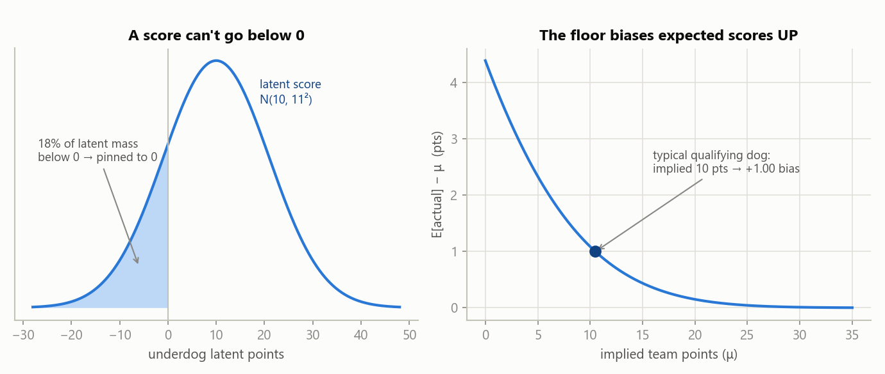
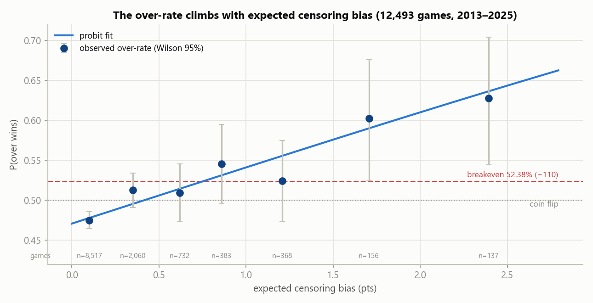
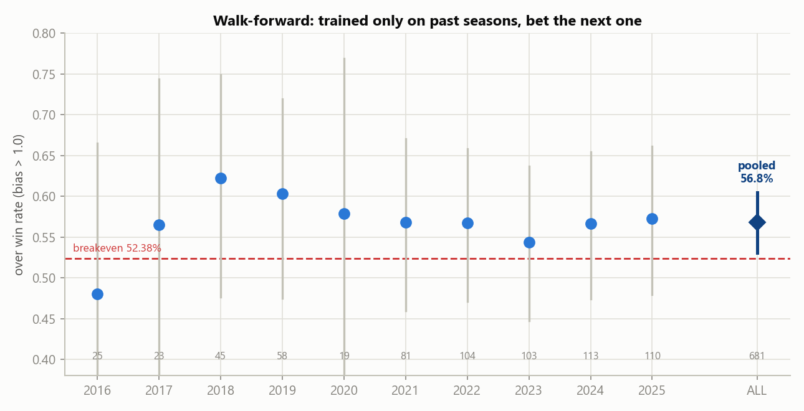
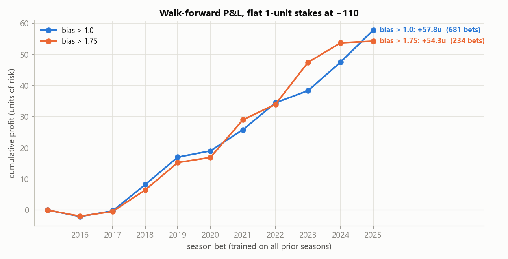
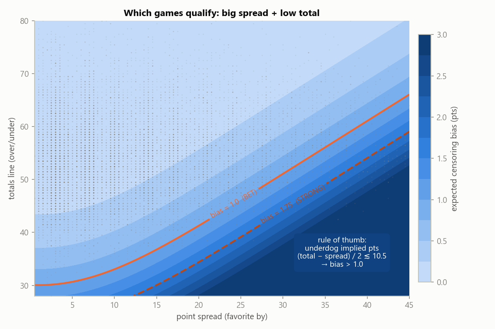

# The Floor Bias model — complete guide

*How the model works, the evidence behind it, and exactly how to use it to
place real bets. All numbers in this guide come from 12,493 real CFBD games,
2013–2025, generated by the code in this repo (figures rebuilt 2026-07-30).*

> **What this is:** a research model with a documented, walk-forward-validated
> edge of ~4.5 points of win rate over breakeven on a specific, rare bet type.
> It is not a money printer: roughly one season in five will lose even if the
> edge is fully real, and the edge can decay as books adapt. Bet only what you
> can afford to lose, at legal books, and read [§8 Failure modes](#8-failure-modes--limits)
> before staking anything.

## TL;DR

**Bet the OVER on the college football game total — the standard combined
over/under on both teams' points — when the expected censoring bias computed
from the two closing game lines exceeds 1.0 points, at −110 juice or
better.**

| Filter | Bets (2016–2025, walk-forward) | Win% | Wilson 95% CI | Flat-stake return |
|---|---|---|---|---|
| bias > 1.0 (standard) | 681 (~70/season) | **56.83%** | [53.1%, 60.5%] | **+8.5%** per unit staked |
| bias > 1.75 (strong) | 234 (~23/season) | **64.53%** | [58.2%, 70.4%] | **+23.2%** per unit staked |

Breakeven at −110 is 52.38%. Both filters clear it with the *lower bound* of
their confidence interval, under the honest protocol (model trained only on
past seasons). One command scores any game: `python monitor/score_game.py SPREAD TOTAL`.

### Which lines this guide means

Four point-related quantities appear below; two are markets, two are model
internals. Don't mix them up:

| Term | What it is | Role here |
|---|---|---|
| **Game spread** | The standard point spread — the favorite's margin line (e.g. Army −21) | Model input |
| **Game total** | The standard over/under on **both teams' combined points** (e.g. 41) | Model input **and the market you bet** (over only) |
| **Implied team points** (`dogPointEst`, `favPointEst`) | Each team's expected score, *derived* from the two game lines: dog = (game total − game spread) / 2 | Internal computed quantity — it is **not** a line you can bet |
| **Team total** | A *separate* sportsbook market on **one** team's points (e.g. "Navy team total over 13.5") | **Not used and not validated** — a candidate future instrument only (open question 3) |

There is no "team spread" market — *spread* in this guide always means the
game spread. Every per-team number the model produces is an *implied team
points* estimate, not a bettable team line.

---

## 1. Why the over is systematically underpriced

The idea comes from Arscott (2022), *"Market efficiency and censoring bias in
college football gambling"* (SSRN 4197428), replicated and extended by this
repo.

The game spread and the game total jointly imply how many points each team
is expected to score:

```
dogPointEst = (gameTotal − gameSpread) / 2    # underdog implied points
favPointEst = dogPointEst + gameSpread        # favorite implied points
```

Example: favorite by 21 with a game total of 41 → underdog implied 10,
favorite implied 31. These implied team points are derived from the two game
lines — they are the model's internal estimate of each side's scoring, not
the sportsbook's team-totals market.

Books set these lines around each team's *latent* expected score — the score
a team "deserves" given its strength. But an actual score **cannot go below
zero**. A 10-point underdog that has a disastrous day doesn't score −8; it
scores 0. The downside is chopped off while the upside is not:



For a latent score `X* ~ N(μ, σ²)` observed as `max(0, X*)`, the observed
mean exceeds the latent mean by exactly

```
bias(μ, σ) = σ·φ(μ/σ) − μ·Φ(−μ/σ)   ≥ 0
```

With the score noise this data estimates (σ ≈ 11 points per team), that bias
is ~1.0 point for a team implied to score 10, and essentially zero for a team
implied to score 25+ (right panel above).

Two consequences, both confirmed in this data:

- **Game totals**: the biases of the two teams *add*. Realized combined
  scores systematically exceed low game-totals lines → **the over is
  underpriced** in exactly the games where a team's implied score is near
  the floor.
- **Game spreads**: the biases *subtract* (favorite bias − underdog bias)
  and mostly cancel → the spread stays fair. There is no spread edge, and
  the mirrored "under edge from a scoring ceiling" was tested and does
  **not** exist ([saturation_bias/](../saturation_bias/) — negative result).

## 2. The pipeline (what the code actually does)

| Step | What | Where |
|---|---|---|
| 1 | Implied team points from game spread + game total | `implied_team_points` ([v2/models_v2.py](../v2/models_v2.py)) |
| 2 | Estimate score noise σ per role with a left-censored **Tobit** MLE (handles the pile-up at 0 correctly; OLS would not) | `tobit_left_censored_v2` |
| 3 | Expected censoring bias per game: `biasTotals = bias(dog) + bias(fav)` | `censoring_bias` |
| 4 | **Probit** maps bias → P(over wins), fit on realized outcomes | `probit_win_v2` |
| 5 | Bet rule: over when `biasTotals > 1.0` | drivers / `score_game.py` |

Trained on all 12,493 games (2013–2025): **σ_dog = 11.03, σ_fav = 11.78**
(paper: 11.28 / 11.94), probit slope **+0.176** (season-clustered SE 0.020,
p ≈ 1e−18). The 1.0 threshold is the paper's, not fit to this data — the
fitted "bias that clears breakeven" lands at 0.75, so 1.0 is conservative.

Only the two betting lines go in. No team ratings, no weather, no injuries —
which is the point: this is mispricing you can compute from the board itself.

## 3. The evidence

**The relationship, in raw data.** Bin all games by their expected censoring
bias and the realized over-rate climbs exactly as the theory says, crossing
breakeven right around bias ≈ 0.75–1.0:



**The deployable test.** Randomized cross-validation lets the model peek at
future seasons, so this repo also runs the strict protocol: for each season t,
train *only* on seasons before t, then bet season t. Nine of ten test seasons
were profitable:





**Every robustness check run so far, and what it found:**

| Check | Result |
|---|---|
| Replicates the paper? | Yes — paper found 55.72% (1992–2017 Goldsheet); this repo finds 56.62% in-sample on *non-overlapping* years (2013–2025 CFBD) |
| Survives honest time ordering? | Yes — walk-forward 56.83% / 681 bets, Wilson 95% [53.1, 60.5], p = 0.020 vs breakeven |
| Survives dependence-aware inference? | Yes — probit slope p ≈ 1e−18 with season-clustered SEs (13 clusters, indicative) |
| Artifact of soft books? | No — consensus-only lines: **58.16%** / 282 bets (stronger, not weaker) |
| Just a proxy for "low total / lopsided"? | No — [v3](../v3/) shows `biasTotals` dominates the raw total and spread in- and out-of-sample; nothing simpler replaces it |
| Sensitive to the independence assumption? | No — [v2](../v2/) proves biasTotals is invariant to fav/dog error correlation (ρ̂ = +0.07) |
| Decaying as books adapt? | Not yet — per-season probit slope trend +0.006/yr, p = 0.55 ([monitor/](../monitor/)) |
| Symmetric under edge? | No — refuted ([saturation_bias/](../saturation_bias/)) |

**Honesty about strength:** the *inefficiency* claim (the totals line ignores
censoring) is overwhelming — p ≈ 1e−18. The *profitability* claim is solid
but thinner: p ≈ 0.02 against breakeven on 681 walk-forward bets. A real but
modest edge.

## 4. Which games qualify

`biasTotals` is driven almost entirely by the **underdog's implied points**.
The qualifying region is big spread + low total:



**Rule of thumb: `(game total − game spread) / 2 ≲ 10.5` → the game
qualifies.**
Exact frontier (underdog implied points at which bias crosses each
threshold): 11.5 → 10.5 as the spread grows from 10 to 30 for bias 1.0;
about 8.3 → 7.0 for bias 1.75. Worked examples (verify any of these with
`score_game.py`):

| Game spread | Game total | Dog implied pts | Bias | Verdict |
|---|---|---|---|---|
| 3.5 | 62.5 | 29.50 | 0.02 | pass |
| 14 | 47.5 | 16.75 | 0.33 | pass |
| 21.5 | 44.5 | 11.50 | 0.86 | pass — close |
| **21** | **41** | **10.00** | **1.11** | **BET over** |
| **24** | **43** | **9.50** | **1.20** | **BET over** |
| **30** | **47** | **8.50** | **1.40** | **BET over** |
| **35** | **48.5** | **6.75** | **1.83** | **STRONG BET over** |
| **28** | **40.5** | **6.25** | **1.97** | **STRONG BET over** |

In practice these are games like a ranked team hosting an overmatched
opponent with a defensive profile, service-academy/triple-option matchups
with low totals, and weather-suppressed lines with big favorites. About 5–6%
of all lined games qualify at bias > 1.0 — roughly **70–110 bets per season**
in recent years (2013–2017 had thinner CFBD line coverage, hence fewer).

## 5. The betting playbook

### Weekly workflow

1. **As close to kickoff as practical** (the model is validated on
   closing-type lines), collect the game spread and the game total (the
   combined over/under — not team totals) for the day's games. Skim for
   candidates with the rule of thumb: `(game total − game spread)/2 ≲ 10.5`.
2. **Score the candidates** (spread sign doesn't matter):

   ```bash
   python monitor/score_game.py 21 41  30 47  3.5 62.5  35 48.5
   ```

   ```
   Trained on 12,493 games 2013-2025: sigma dog=11.03 fav=11.78, probit const=-0.073 slope=+0.176

      spread  total  dogEst   bias  P(over)  verdict
        21.0   41.0   10.00   1.11   54.88%  BET over
        30.0   47.0    8.50   1.40   56.88%  BET over
         3.5   62.5   29.50   0.02   47.24%  pass
        35.0   48.5    6.75   1.83   59.81%  STRONG BET over
   ```

3. **Apply every filter** (below). A game must pass all of them.
4. **Size and place** the over bets (sizing below).
5. **Log every bet**: date, teams, spread, total, price, bias, result. The log
   is what lets you compare your realized prices to the model's assumptions
   and feed the decay monitor.

### The filters — all must pass

| # | Filter | Why |
|---|---|---|
| 1 | **`biasTotals > 1.0`** (treat > 1.75 as high-conviction) | The validated signal. Walk-forward: 56.8% / 64.5% |
| 2 | **Price −110 or better on the over** | The 52.38% breakeven is priced in; worse juice eats the ~4.5 pp edge fast (table below) |
| 3 | **Full-game combined totals only** | The validated market is the game total. Team totals are untested here (open question 3); 1H overs are theoretically stronger but unvalidated until real 1H lines exist ([floor_bias_1h/](../floor_bias_1h/)); unders are refuted |
| 4 | **Not a pick'em** (spread ≠ 0) | Outside the model's sample definition |
| 5 | **Line from a major book or consensus** | Validated on consensus and any-major-book lines (consensus-only was *stronger*: 58.2%) |
| 6 | **Recompute if the line moves** | Bias is a function of the current numbers; a total dropping 3 pts or spread moving 4 changes the verdict |

### Price rules

Breakeven win rate by juice, against the walk-forward edge:

| Over price | Breakeven | Edge at bias > 1.0 (56.8%) | Edge at bias > 1.75 (64.5%) |
|---|---|---|---|
| −105 | 51.22% | +5.6 pp | +13.3 pp |
| **−110** | **52.38%** | **+4.5 pp** | **+12.2 pp** |
| −115 | 53.49% | +3.3 pp | +11.0 pp |
| −120 | 54.55% | +2.3 pp | +10.0 pp |

**Rule: take −110 or better at bias > 1.0. Between −111 and −120, only bet if
bias > 1.75. Never worse than −120.** Shop lines — a half-point of juice is a
fifth of the edge.

### Getting the best number and price

The two things you shop for are the **game total** (the number) and the
**juice** (the price). They convert into each other at a fixed rate, because
the game-totals forecast error has σ ≈ 16.3 points:

- **Each 1.0 point of total ≈ 2.45 pp of win probability.** A half-point
  ≈ 1.22 pp.
- **Each 5 cents of juice ≈ 1.1 pp of breakeven** (−110 → −115 moves
  breakeven 52.38% → 53.49%).
- So **a half-point of total ≈ 5 cents of juice**. Over 41.0 at −115 and over
  41.5 at −110 are nearly the same bet; prefer the lower total when it's
  close (a lower number can also turn a loss into a push on integer totals).

Practical rules, in order of value:

1. **Take the lowest total on the board.** Shop books before shopping juice —
   over 40.5 at −110 beats over 41.5 at −105. For the over, lower number =
   strictly better, and every point is worth ~2.4 pp.
2. **Then take the best juice at that number** (−105 beats −110 by 1.16 pp of
   breakeven — a quarter of the standard edge, for free).
3. **Never buy the hook.** Books sell the half-point at ~10 cents; it's worth
   ~5. Buying 41.0 → 40.5 for −120 pays 2.2 pp of breakeven for 1.2 pp of
   win probability — a losing trade every time.
4. **Score the game at the number you actually take**, not the consensus.
   `score_game.py 21 40.5` and `21 42.5` can straddle the threshold.

**When to bet.** The edge is *structural*, not informational: the closing
line itself is mispriced, so — unlike steam-chasing strategies — you do not
need to beat the close to have the edge. The backtest is validated on
closing-type numbers, which means:

- **Default: bet close to kickoff** (day-of). That is the validated protocol,
  and it prices in all late news (weather, QB scratches) that could move a
  qualifying total.
- **Betting earlier in the week is fine when the number qualifies** — the
  mispricing is a function of the number itself — but you take on line-move
  risk both ways, and early totals carry more non-model uncertainty.
- **Whether early numbers are systematically better is an open question**
  (CFBD carries one snapshot per game, so open-to-close drift in qualifying
  games is unmeasured — see §10). Resolve it yourself with your bet log:
  record your total vs the closing total. Each point below close ≈ +2.4 pp
  over the validated 56.8%; each point above ≈ −2.4 pp. If your CLV is
  consistently positive early in the week, move earlier; if negative, wait
  for the close.

### Sizing

- **Baseline: flat stakes, 1 unit = 1% of bankroll.** This is what the
  +8.5%/+23.2% returns above are computed on and it is hard to get wrong.
- **Quarter-Kelly if you want growth-optimal-ish sizing:** full Kelly at
  p ≈ 0.57 and −110 is `f = (0.909p − q)/0.909 ≈ 5.5%` of bankroll per bet —
  far too violent. Quarter of that ≈ **1.3–1.5% per bet**, similar to flat.
- **Never full Kelly.** Bets land simultaneously on Saturday slates, so you
  cannot re-size on each outcome; treat a weekend's 5–10 qualifying bets as
  one exposure and keep the slate total under ~8–10% of bankroll.

### What to expect (variance, in advance)

- **A losing season happens ~1 year in 5** even if the true edge is exactly
  the walk-forward 56.8%: at ~80 bets/season the standard deviation of the
  season win rate is ±5.5 pp. The 2016 walk-forward season lost −8.4%. This
  is normal operation, not a broken model.
- Expected season at flat 1u stakes, bias > 1.0: ~70–110 bets, ~+6u
  (long-run average ≈ +8.5% of turnover), with a realistic season range of
  roughly −15u to +25u.
- The strong filter (1.75) is ~23 bets/season with a much fatter per-bet
  edge — a sensible choice if you want fewer, better bets. Over 2016–2025 it
  made nearly the same total profit as the standard filter (+54u vs +58u) on
  a third of the volume.

### Maintenance and stop rules

The edge is published research (SSRN 2022). Books can adapt. Treat it as
perishable:

- **After every season**: re-run `python monitor/run_walkforward.py` and
  `python monitor/run_monitor.py` with the new season's data scraped into
  `cfb-site`.
- **Warning signs** (from the monitor): the trailing 3-season window flags
  `SLOPE~0` (probit slope CI includes zero), the bias needed to clear
  breakeven trends up, or the slope trend test goes significantly negative.
  Judge on trailing windows, not single seasons — per-season flags fire on
  noise by design.
- **Stop** when a trailing 3-season window shows both `SLOPE~0` and a win% CI
  centered at/below breakeven. As of 2025 data: no decay (trend +0.006/yr,
  p = 0.55; every window since 2016 has a positive significant slope).

## 6. Commands reference

```bash
# score today's games (the only command you need on gameday)
python monitor/score_game.py SPREAD TOTAL [SPREAD TOTAL ...]

# annual maintenance
python monitor/run_walkforward.py            # deployable-protocol backtest
python monitor/run_monitor.py                # decay tables + trend test

# research drivers
python v1/demo_reproduce.py                  # synthetic self-test (asserts)
python v1/run_on_project_data.py --raw --season 2013 ... 2025
python v2/run_v2.py                          # SEs + correlation caveats
python v3/run_v3.py                          # feature bake-off
python saturation_bias/run_saturation.py     # the under-side negative result
```

Data comes from a sibling `cfb-site` checkout
(`../cfb-site/data/raw/lines_{season}.json`) — see the [root README](../README.md).

## 7. Model summary card

| | |
|---|---|
| Bet | CFB **game totals** (combined over/under, both teams), **over only** — not team totals |
| Signal | `biasTotals` = expected left-censoring bias implied by spread + total |
| Threshold | > 1.0 (standard), > 1.75 (strong) |
| Price | −110 or better (to −120 only if strong) |
| Number | lowest total on the board; 0.5 pt ≈ 5 cents of juice; never buy the hook |
| Timing | day-of/close (validated protocol); earlier OK if the number qualifies — log CLV |
| Sizing | flat 1% or ¼-Kelly ≈ 1.4% |
| Volume | ~70–110 bets/season (standard), ~23 (strong) |
| Validated edge | 56.83% [53.1, 60.5] / 64.53% [58.2, 70.4], walk-forward 2016–2025 |
| Kill switch | trailing 3-season slope ≈ 0 with win% at/below breakeven |

## 8. Failure modes & limits

- **The edge is not uniform across the board — and may be absent on the FBS
  slate.** Splitting the walk-forward bets by division
  ([EXTENSIONS.md §3](EXTENSIONS.md#3-the-empirical-finding-it-already-travels--one-rung-down-not-sideways),
  `python research/extensions/division_cohorts.py`): FBS-vs-FBS games go
  **50.0% over 268 bets** (−4.5% per unit) while games involving an FCS team
  go 59.4%–68.2%. The headline 56.83% is a blend. The censoring signal is
  positive and significant in all three cohorts, but at bias > 1.0 it only
  clears the vig in cross-division and FCS games. At bias > 1.75 the FBS board
  does clear it (56.1% over 57 bets), so the likely reading is that **the
  threshold that beats the vig is division-dependent** — ~1.0 where the
  mismatch is structural, higher on the FBS slate. This is a post-hoc subgroup
  split and is **not yet** a rule change — but if you are betting the FBS
  board at bias > 1.0 on the strength of the headline number, know that the
  headline is carried by games elsewhere. Read that section's caveats first.
- **The books read SSRN too.** If books shade qualifying totals up (or tilt
  juice to −115/−120 on those overs), the edge compresses precisely where
  filter 2 catches it. The price filter is not optional.
- **Your price ≠ the data's price.** The backtest uses CFBD lines
  (closing-type, major books). If you consistently bet earlier or at worse
  numbers, your realized edge differs. Log closing lines against your bets
  (closing-line value) to measure it.
- **Rule changes move σ.** The 2023/2024 clock rules changed scoring volume;
  annual retraining (which walk-forward does by construction) absorbs this,
  stale parameters would not.
- **The model is deliberately blind** to weather, injuries, and pace. That
  keeps it honest, but it means the bias is only as current as the lines you
  feed it — recompute after line moves, and expect some qualifying bets to be
  games where you have private reasons to hate the over. Follow the model or
  track your overrides; don't do both untracked.
- **Compounded-return claims are upper bounds.** Sequential Kelly compounding
  is impossible on simultaneous slates; the flat-stake returns are the real
  numbers.
- **This is research, not financial advice.** Sports betting is
  negative-expectation for almost everyone; a 4.5 pp edge, if it persists, is
  grindy and volatile. Legality depends on your jurisdiction.

## 9. Next steps

Open questions (§10) are what we *don't know*; this is what to *do*, in
order. Three tracks — they don't block each other.

### A. If you're going to bet it (this season)

1. **Dry-run one full Saturday before staking.** Score the whole slate
   (`score_game.py`), check the qualifying list against the board, and
   confirm the verdicts and prices look like §4–§5 say they should. Costs
   nothing, catches setup mistakes.
2. **Start the bet log on day one.** Columns: date, teams, book, game spread
   taken, game total taken, price, bias, model P(over), closing game total,
   closing price, result. This log is not bookkeeping — it is the instrument
   that resolves open questions 4 (timing/CLV) and 5 (real juice on
   qualifying overs).
3. **Ramp sizing.** First ~25–30 bets at half stakes (0.5u) while the log
   confirms two assumptions: you can actually get ~−110, and your CLV is not
   systematically negative. Both hold → move to full sizing (§5). Either
   fails → the realized edge is thinner than backtested; recompute before
   scaling.
4. **Close the season loop.** After the season: scrape it into `cfb-site`
   (`python -m cfb_system_maker scrape --season 2026`), rerun
   `monitor/run_walkforward.py` and `monitor/run_monitor.py`, and check the
   stop rules (§5) before betting the next year.

### B. Research, ranked by expected payoff

> Ready-to-execute plan for all five items (written for hand-off to a
> cheaper/less-context model, with exact code, commands, guardrails, and
> stop rules):
> [docs/superpowers/plans/2026-07-30-research-track-b.md](superpowers/plans/2026-07-30-research-track-b.md)

| # | Step | Effort | Resolves |
|---|---|---|---|
| 1 | Hunt down historical **1H closing lines** (`game_id,half_spread,half_total`) and run the ready-made backtest: `python floor_bias_1h/run_1h.py --half-lines file.csv` | Data hunt only — the model is already built | Q2: a theoretically ~2.3× stronger edge, whole new market |
| 2 | Source a **team-totals** line history and backtest "dog team total over" with the existing pipeline | Small new driver on existing estimators | Q3: the purest instrument for the mechanism |
| 3 | Capture **multi-snapshot odds** (open / mid-week / close, with prices) for one season of qualifying games | Scraper addition to cfb-site | Q4 (best timing) and Q5 (real juice) at once |
| 4 | Regress the probit residuals on **weather / pace / style** features already in cfb-site data | Analysis only, data on hand | Q1: why the realized edge is ~2× the pure-censoring prediction |
| 5 | **Hierarchical team-level σ** (shrunk toward the pooled value) | Modeling work | Q9: sharper borderline bets |

Items 1–3 are data-acquisition problems, not modeling problems — the code
side is ready or trivial. That's why they rank first.

### C. Engineering conveniences

- **`score_week.py`**: pull the current week's game lines from the CFBD API
  (cfb-site already has the scraper/auth), score every game, print the
  qualifying list with verdicts — removes the manual number entry from the
  weekly workflow.
- **Bet-log template + CLV summarizer**: a CSV header to standardize track A
  step 2, plus a 30-line script that reports your average price, average
  CLV in points, and realized-vs-expected win rate.
- **Season-maintenance checklist** in [monitor/README.md](../monitor/README.md)
  so track A step 4 is a copy-paste ritual, not memory.

## 10. Open questions

Ranked roughly by how much each could change the strategy, with what would
resolve it.

1. **Why is the realized edge bigger than censoring alone predicts?**
   Pure-censoring theory says the over-rate should climb from ~50.2% to
   ~52.3% across the bias bins; empirically it climbs 47.7% → 55.9%
   ([v2](../v2/)'s bonus finding). [v3](../v3/) ruled out "it's just low
   totals/lopsided" — so something *else* mispriced correlates with
   high-censoring games: fat-tailed scoring, garbage-time dynamics, or
   public under-appetite for ugly games. Resolving it needs features beyond
   the two lines (pace, weather, play-calling) and could either enlarge the
   edge or explain when it fails.
2. **Is the first-half edge real?** Theory says the 1H over edge should be
   ~2.3× stronger (censoring binds much harder on ~10-point half scores), and
   the approximation survives de-biasing — but it is unvalidated until
   someone supplies real historical 1H closing lines
   (`game_id,half_spread,half_total` → `python floor_bias_1h/run_1h.py
   --half-lines file.csv`, [floor_bias_1h/](../floor_bias_1h/)). Potentially
   the biggest upgrade available; odds archives (Unabated, OddsJam,
   SBR-style archives) carry 1H markets.
3. **Underdog team totals — a diagnostic, not a sharper instrument.**
   *Revised 2026-07-31 — the original premise here was wrong.* This question
   used to propose the dog team total as "the purest expression", carrying the
   bias undiluted by the favorite's noise. Under pure censoring it carries
   **exactly nothing**: censoring is a *mean* effect, all displaced mass piles
   at 0 far below the line, so `P(max(0,X) > μ) = P(X > μ) = 0.5` and the
   median is untouched. Pooling the two sides is what turns the mean gap into
   a quantile shift ([EXTENSIONS.md §2a](EXTENSIONS.md#2a-the-pooling-theorem--censoring-alone-does-not-pay-on-a-single-side)).
   The backtest is still worth running, for a better reason: pure censoring
   predicts *exactly* 50%, so any edge found on dog team totals is a clean
   measurement of the open-question-1 residual, isolated from censoring for
   the first time. The validated bet remains the combined game total only.
4. **Do early-week numbers beat the close in qualifying games?** CFBD stores
   one snapshot, so open-to-close drift is unmeasured (see "When to bet",
   §5). If qualifying totals systematically rise toward kickoff, betting
   openers adds points of CLV on top of the structural edge; if they fall,
   the close is the floor. A season of multi-snapshot odds data (or your own
   bet log) settles it.
5. **What juice do books actually charge on qualifying overs?** CFBD carries
   numbers, not prices; the backtest assumes −110 both sides. If books
   already shade qualifying overs to −115/−120, the realized edge is 1–2 pp
   thinner than measured. Your bet log answers this immediately; a
   price-history feed answers it retroactively.
6. **How much money can this absorb?** Qualifying games are low-liquidity
   (mid-week MAC games, service academies); totals limits there are small,
   and a few thousand dollars can move the number. The edge may persist
   *because* it is not worth a book's while to fix. Unknown: the bankroll
   size at which you become the line move. Relevant if sizing beyond
   recreational units.
7. **Does the mechanism travel?** Worked through properly in
   [EXTENSIONS.md](EXTENSIONS.md), which restates the model as a zero-strike
   Bachelier call, gives a screening statistic (bias-to-noise ratio; −110
   needs BNR ≳ 0.060), and ranks candidate markets. Short version: NFL and
   basketball are dead (means 2σ+ from the floor); soccer is dead *despite*
   the lowest scores in sport, because books already model goals as
   non-negative counts — the edge comes from a book using a Gaussian/linear
   representation for a bounded quantity, not from scores being near zero.
   The live candidates are shorter windows in football (§2b's √t law), MLB's
   unplayed bottom of the 9th (a different, stronger boundary type), and —
   already measurable in this repo's data — lower-division CFB (§8 below).
8. **Is the Gaussian-Tobit approximation costing accuracy?** Football scores
   are discrete and clumped (0, 3, 7, 10…), and the latent-normal assumption
   is an approximation. A discrete scoring model (drive-based or
   points-distribution) would give sharper per-game bias estimates —
   probably second-order for the bet/no-bet decision, first-order if anyone
   tries to price P(over) precisely enough for Kelly sizing per game.
9. **Team-level σ heterogeneity.** One σ per role (dog/favorite) is fitted
   for all teams; triple-option and extreme-tempo teams plausibly have
   different score variance, which changes their censoring bias at the same
   implied points. A hierarchical σ (team- or style-level, shrunk toward the
   pooled value) might re-rank borderline bets — with the usual overfitting
   and generated-regressor risks.
10. **Why is the edge concentrated in FCS/cross-division games?** *(New
   2026-07-31; by size of effect this belongs near the top of this list —
   left last only to keep the existing numbering stable.)* The walk-forward
   edge is carried almost entirely by games involving an FCS team; FBS-vs-FBS
   sits at 50.0% over 268 bets
   ([EXTENSIONS.md §3](EXTENSIONS.md#3-the-empirical-finding-it-already-travels--one-rung-down-not-sideways)).
   Two readings: *mechanism* (mismatches drive dogs toward the floor —
   cross-division games shut out the dog 12.7% of the time vs 2.9% in FBS),
   or *market quality* (books price FCS boards with less effort and lower
   limits, so nobody is paid to kill the edge). Not exclusive. The second
   reading implies a hard capacity ceiling (question 6) and makes the FBS
   result decay rather than absence. Resolving it decides whether the bet
   rule should carry a division filter. Wants a threshold sweep and a
   per-season stability check first — both cheap, data already local.

---

*Full derivations and per-version results: [v1](../v1/) (baseline + math),
[v2](../v2/) (standard errors, correlation), [v3](../v3/) (is it really
censoring?), [saturation_bias](../saturation_bias/) (under-side negative
result), [floor_bias_1h](../floor_bias_1h/) (first-half extension, awaiting
real 1H lines), [monitor](../monitor/) (decay + walk-forward). Review and
audit: [REVIEW.md](../REVIEW.md).*
